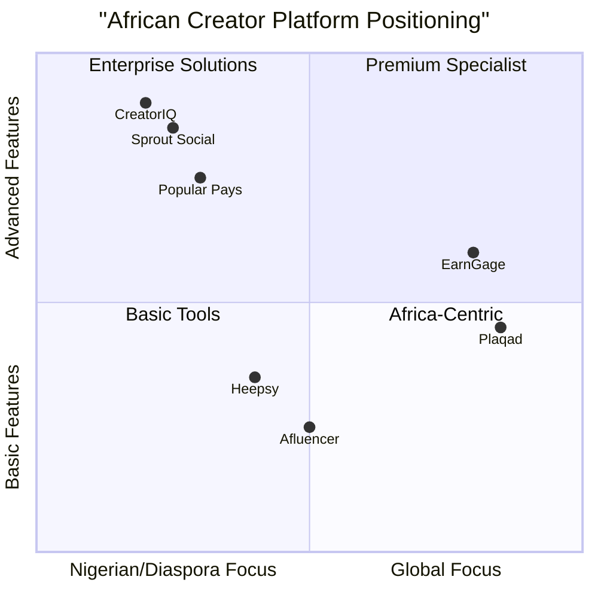

# EarnGage Product Requirements Document

## Project Information

- **Project Name**: EarnGage
- **Document Version**: 1.0
- **Date**: 2024-05-31

## Original Requirements

Build a web application that connects nano and micro creators to brand campaigns based on the provided Figma designs: [EarnGage Figma Design](https://www.figma.com/design/E2bbtggfbgr08O9m7O29GZ/EarnGage?node-id=17-2466)

## 1. Product Definition

### 1.1 Product Goals

1. **Connect African Creators and Brands**: Create a seamless platform that matches Nigerian and diaspora-based nano and micro creators with relevant brand campaigns targeting the African market, based on their niche, audience demographics, and content style
2. **Streamline Campaign Management**: Provide tools for brands to create, manage, and track campaigns in the African context while enabling creators to discover, apply, and fulfill campaign requirements efficiently
3. **Maximize ROI for All Parties**: Generate measurable value for brands through authentic African creator partnerships while ensuring fair compensation and growth opportunities for creators in the Nigerian ecosystem and diaspora

### 1.2 User Stories

#### Creators
1. **As a Nigerian nano creator**, I want to easily discover brand campaigns relevant to the African market that match my niche and audience, so that I can collaborate with relevant brands and monetize my content
2. **As a Nigerian diaspora micro influencer**, I want to showcase my performance metrics and content portfolio targeting both African and international audiences, so that brands can recognize my unique value in reaching Nigerians globally
3. **As a creator in Nigeria**, I want to manage multiple campaign applications and active collaborations in one place, so that I can efficiently organize my brand partnerships despite potential infrastructure challenges
4. **As an African creator**, I want to receive fair compensation in my preferred payment methods, so that I can sustain my content creation career within the Nigerian economic context

#### Brands
1. **As a brand marketer targeting the Nigerian market**, I want to set specific targeting criteria for campaigns, so that I can reach the right African audience through culturally-relevant creators
2. **As a brand manager**, I want to review detailed analytics on campaign performance in Nigeria and among diaspora audiences, so that I can measure ROI and optimize future campaigns for the African context
3. **As a Nigerian small business owner**, I want an affordable way to work with local authentic creators, so that I can leverage influencer marketing tailored to the Nigerian market without a massive budget

#### Platform Administrators
1. **As a platform administrator**, I want to verify creator credentials and brand legitimacy within the Nigerian market context, so that I can maintain a trustworthy ecosystem that understands local business practices
2. **As a support specialist**, I want to assist users with questions and technical issues while understanding Nigerian infrastructure challenges, so that they have a smooth experience on the platform
3. **As a community manager**, I want to organize virtual and physical events in Nigeria and for the diaspora community, so that we can build stronger connections between creators and brands

### 1.3 Competitive Analysis

| Platform | Pros | Cons |
|----------|------|------|
| **Sprout Social** | - Advanced AI-powered search - Brand Fit Score system - Comprehensive analytics | - Enterprise-focused pricing - Complex for small brands - Limited focus on African market |
| **Popular Pays** | - AI-powered capabilities - Official platform integrations - 70% faster campaign setup | - Higher price point - Minimal presence in Nigeria - Payment systems unsuitable for African creators |
| **Heepsy** | - Budget-friendly option - Good for small businesses - Extensive global database | - Basic analytics - Limited African creator representation - No cultural context for Nigerian market |
| **Plaqad** | - Nigerian-based platform - Local market understanding - Nigerian payment integration | - Limited international brand exposure - Basic feature set - Smaller reach for diaspora creators |
| **Afluencer** | - Free entry plan - Growing African presence - Multiple industry segments | - Limited localized features - Poor adaptation to Nigerian internet infrastructure - Limited payment options for Nigerian creators |
| **CreatorIQ** | - Enterprise-level solutions - Used by global brands - Advanced features | - Very expensive ($36K/year) - No specific focus on African markets - Payment systems favor Western creators |
| **EarnGage (Target)** | - Focus on Nigerian/diaspora creators - Culturally relevant interface - Multiple payment options for Nigerian market | - New market entrant - Building Nigerian creator base - Limited track record |

### 1.4 Competitive Quadrant Chart

## 2. Technical Specifications

### 2.1 Requirements Analysis

Based on the Figma designs and Nigerian market research, EarnGage requires the following technical capabilities tailored to the African context:

1. **User Authentication System**: 
   - Separate registration and login flows for creators and brands with email verification
   - Social login options popular in Nigeria (WhatsApp, Instagram, Facebook)
   - Low-bandwidth authentication options for areas with limited internet connectivity
   - OTP verification via SMS for the Nigerian market

2. **Profile Management**: 
   - Comprehensive profile creation optimized for intermittent connectivity
   - Portfolio uploads with image compression for Nigerian mobile data considerations
   - Nigeria-specific audience demographics and metrics
   - Social account linking with popular Nigerian platforms
   - BVN or NIN verification options for Nigerian creators

3. **Campaign Creation & Discovery**: 
   - Interface for brands to create campaigns targeting Nigerian demographics
   - Cultural context specifications for Nigerian campaigns
   - Location-based filtering for campaigns targeting specific Nigerian regions
   - Mobile-first design for the Nigerian market's predominantly mobile internet users

4. **Application & Selection Process**: 
   - System optimized for intermittent connectivity
   - Offline application drafting capabilities
   - Nigerian English language support
   - Local time zone and scheduling considerations

5. **Content Submission & Approval**: 
   - Workflow supporting common Nigerian file formats and sizes
   - Adaptive upload mechanisms for varying bandwidth conditions
   - Support for Nigerian cultural context review

6. **Analytics Dashboard**: 
   - Nigeria-specific performance benchmarks
   - Metrics relevant to Nigerian social media usage patterns
   - Diaspora audience segmentation and insights
   - Data visualization optimized for mobile viewing

7. **Payment Processing**: 
   - Integration with Nigerian payment gateways (Flutterwave, Paystack)
   - Support for bank transfers common in Nigeria
   - Multiple currency support (Naira and international currencies)
   - Mobile money options (USSD compatibility)
   - Cryptocurrency options for diaspora transactions

8. **Messaging & Notifications**: 
   - WhatsApp integration for Nigerian users
   - SMS notifications for low-connectivity situations
   - Data-efficient communication options
   - Scheduling tools considering Nigerian time zones

9. **Admin Panel**: 
   - Tools for platform administrators familiar with Nigerian market conditions
   - Nigerian regulatory compliance monitoring
   - Cultural context moderation features
   - Support for Nigerian business practices and documentation

### 2.2 Requirements Pool

#### P0 (Must-have)
1. User registration and authentication for creators and brands
2. Profile creation and management for both user types
3. Campaign creation interface for brands
4. Campaign discovery and application for creators
5. Application review and selection for brands
6. Basic messaging between creators and brands
7. Content submission and approval workflow
8. Payment processing and transaction history
9. Basic analytics for campaign performance

#### P1 (Should-have)
1. Social media account integration and metrics verification
2. Advanced search and filtering for campaigns and creators
3. AI-powered creator-campaign matching
4. In-app notifications and email alerts
5. Contract and agreement templates
6. Campaign calendar and scheduling tools
7. Enhanced analytics dashboard with exportable reports
8. Content rights management system

#### P2 (Nice-to-have)
1. AI-generated campaign brief assistant
2. Bulk creator management for larger campaigns
3. Creator performance insights and growth tracking
4. API integrations with major social platforms for live data
5. White-label options for agencies
6. Mobile application for on-the-go management
7. Audience overlap analysis between creators
8. Brand safety and fraud detection systems

### 2.3 UI Design Draft

Based on the provided Figma link, the UI design includes:

**Creator Side:**
- Dashboard with campaign opportunities and active collaborations
- Profile editor with portfolio showcase
- Campaign discovery with filtering options
- Application management interface
- Content submission and revision system
- Performance analytics and payment history

**Brand Side:**
- Campaign creation wizard
- Creator discovery and filtering tools
- Application review interface
- Campaign management dashboard
- Content approval workflow
- Performance analytics and ROI tracking

**Shared Features:**
- Messaging interface
- Notification center
- Settings and account management
- Help and support resources

### 2.4 Open Questions

1. **Payment Processing**: What payment gateways will be integrated for international creator payments?

2. **Scalability**: How will the platform handle potential rapid growth in user base?

3. **Content Rights**: What specific terms will govern content ownership and usage rights?

4. **Verification Process**: What specific criteria will be used to verify creator metrics and brand legitimacy?

5. **Dispute Resolution**: What process will be implemented to handle disputes between creators and brands?

6. **Analytics Integration**: Which third-party analytics tools should be integrated to provide comprehensive performance data?

7. **Mobile Strategy**: Should we prioritize a responsive web design or native mobile apps (or both)?

8. **International Support**: What languages and currencies should be supported at launch?

## 3. Implementation Details

### 3.1 Technology Stack Recommendations

**Frontend:**
- Framework: React.js (optimized for progressive loading in low-bandwidth environments)
- Styling: Tailwind CSS (with modular loading for bandwidth efficiency)
- State Management: Redux with offline persistence capabilities
- UI Components: Material UI with Nigeria-inspired theme customization
- Progressive Web App implementation for intermittent connectivity

**Backend:**
- API: Node.js with Express (optimized for variable connection quality)
- Database: PostgreSQL for relational data, MongoDB for content with local caching strategies
- Authentication: JWT with OAuth integrations for Nigerian social platforms
- File Storage: AWS S3 or CloudFlare R2 with edge locations closer to West Africa
- CDN deployment with Nigerian edge locations

**DevOps:**
- CI/CD: GitHub Actions or CircleCI
- Hosting: AWS with West African region options, or Azure with South African data centers
- Containers: Docker with right-sized infrastructure for cost optimization
- Performance monitoring with focus on Nigerian internet conditions

**Third-party Services:**
- Payment Processing: Flutterwave and Paystack for Nigerian transactions, Stripe for international
- Mobile Money Integration: USSD payment options for non-smartphone users
- Email Service: SendGrid with SMS fallback for Nigerian users
- Analytics: Mixpanel or Amplitude with custom Nigerian market benchmarks
- Search: Elasticsearch with optimizations for Nigerian English and pidgin keywords

### 3.2 Development Phases

**Phase 1 (Nigerian Market MVP - 10 weeks):**
- Basic authentication with WhatsApp/Facebook integration for Nigerian users
- Simple campaign creation with Nigeria-specific audience targeting
- Mobile-optimized application and selection process for Nigerian internet conditions
- Essential messaging with WhatsApp fallback option
- Nigerian payment gateways integration (Flutterwave/Paystack)
- Localized content for Nigerian English and audience

**Phase 2 (Core Nigerian Features - 14 weeks):**
- Enhanced profiles with BVN/NIN verification for Nigerian creators
- Advanced search filters for Nigerian regions and cultural contexts
- Complete campaign workflow with offline capabilities
- Nigeria-focused analytics dashboards
- Expanded payment options including mobile money and bank transfers
- Nigerian diaspora features for US/UK/Canada-based users

**Phase 3 (Advanced Nigerian Market Features - 16 weeks):**
- AI-powered matching algorithms calibrated for Nigerian creator-brand matches
- Comprehensive analytics with Nigerian market benchmarks
- API integrations with Nigerian-popular social platforms
- Enhanced content rights management addressing Nigerian IP considerations
- Performance optimization for Nigerian internet infrastructure
- Expansion features for other West African markets

## 4. Market Opportunity

### 4.1 Market Size

#### Global Context
- The creator economy was valued at approximately $143 billion in 2024 and is projected to grow to $1,487 billion by 2034 (CAGR of 26.4%).
- The influencer marketing industry specifically was valued at $24 billion in 2024, up from $21.1 billion in 2023.

#### Nigerian Market
- Nigeria has over 109 million internet users (2023) with a 51% internet penetration rate, creating a significant base for digital creators.
- Social media penetration in Nigeria is approximately 16.1% with about 33 million active users.
- Instagram has approximately 9 million Nigerian users, making it a primary platform for local creators.
- TikTok's rapid growth has reached over 5 million users in Nigeria, creating new opportunities for short-form content.
- With Nigeria's GDP of approximately $440 billion (2023), the digital and creative economy represents a growing sector with significant investment potential.

#### Nigerian Diaspora
- An estimated 17 million Nigerians live abroad, primarily in the US, UK, Canada, and other African countries.
- The Nigerian diaspora contributes approximately $20 billion annually in remittances, indicating strong economic connections to home.
- Diaspora-based creators have unique cross-cultural appeal, reaching both Western audiences and maintaining connections with Nigerian consumers.

### 4.2 Target Audience

**Nigerian Creators:**
- Nigerian nano-influencers (1K-10K followers): Estimated 500,000+ potential users within Nigeria
- Nigerian micro-influencers (10K-100K followers): Estimated 100,000+ potential users within Nigeria
- Focus on culturally-relevant niches: Nollywood, Afrobeats, Nigerian fashion, local cuisine, tech entrepreneurship, etc.
- Young Nigerian creators (18-35) seeking to monetize their influence despite local economic challenges

**Diaspora Nigerian Creators:**
- Nigerian diaspora nano-influencers: Estimated 200,000+ potential users globally
- Nigerian diaspora micro-influencers: Estimated 50,000+ potential users globally
- Focus on cross-cultural content: African fashion in Western contexts, fusion cuisine, cultural education, etc.
- Creators with established audiences in both Nigerian and international markets

**Brands Targeting Nigerian Market:**
- Nigerian small to medium-sized businesses seeking local market penetration
- International brands expanding into the Nigerian market
- Nigeria-focused e-commerce businesses and digital services
- FMCG companies targeting Nigerian consumers
- Fashion, beauty, and lifestyle brands appealing to Nigerian sensibilities

**Brands Targeting Nigerian Diaspora:**
- African cultural products and services gaining international presence
- Remittance and financial services connecting Nigeria with global markets
- Export-oriented Nigerian businesses seeking diaspora markets
- International brands creating culturally-specific campaigns for Nigerian audiences

### 4.3 Monetization Strategy

**Platform Fee Models (Nigeria-specific Pricing):**
1. **Subscription Tiers:**
   - Free: Basic access for creators with limited applications
   - Creator Basic: Enhanced visibility, 10 applications/month (₦2,000-3,000/month or $5-7/month)
   - Creator Pro: Unlimited applications, analytics, verification (₦5,000-7,000/month or $10-15/month)
   - Brand Basic: Campaign creation, 2 active campaigns (₦20,000-30,000/month or $40-60/month)
   - Brand Pro: Multiple campaigns, advanced analytics (₦50,000-80,000/month or $100-160/month)
   - Enterprise: Custom solutions for agencies and large brands (custom pricing)

2. **Transaction Fees (Adapted to Nigerian Market):**
   - 8-12% commission on successful campaign payments (lower than global rates to account for Nigerian market conditions)
   - Optional escrow service fee (1.5-2.5%)
   - Multiple payment options: Bank transfers, mobile money (Flutterwave/Paystack), cryptocurrency for diaspora transactions

3. **Additional Revenue Streams:**
   - Featured listings for campaigns or creators
   - Advanced analytics packages
   - Verification badge fees with Nigerian verification partnerships
   - Virtual events and creator workshops
   - Brand-creator matchmaking services
   - Cross-border payment facilitation for diaspora creators

## 5. Success Metrics

### 5.1 Key Performance Indicators

**Nigerian Market Platform Growth:**
- Monthly active creators and brands in Nigeria and diaspora regions (US, UK, Canada)
- User retention rates across different Nigerian connectivity environments (30/60/90 day)
- Conversion from free to paid subscriptions accounting for Nigerian economic context
- Geographic distribution across Nigerian states and major diaspora hubs

**Nigeria-Specific Engagement Metrics:**
- Number of campaigns created targeting Nigerian audiences
- Average applications per campaign from Nigerian vs diaspora creators
- Campaign completion rate considering Nigerian infrastructure challenges
- Message response time accounting for time zone differences between Nigeria and diaspora
- Nigerian social media engagement performance benchmarks

**Financial Metrics (Nigeria-Focused):**
- Monthly Recurring Revenue (MRR) in both Naira and USD
- Average Revenue Per User (ARPU) segmented by Nigerian vs diaspora users
- Customer Acquisition Cost (CAC) for Nigerian market (typically lower than Western markets)
- Lifetime Value (LTV) with adjustments for Nigerian economic conditions
- Currency exchange impact assessment

**Nigerian Creator Success Metrics:**
- Average earnings per creator in Naira for local creators
- Payment success rates across different Nigerian payment methods
- Campaign acceptance rate for Nigerian vs international brands
- Creator retention and growth within the Nigerian economic context
- Skills development and professional growth metrics

**Brand Success Metrics for Nigerian Market:**
- Campaign ROI within Nigerian consumer context
- Content cultural relevance ratings for Nigerian audiences
- Repeat campaign creation rate from Nigerian businesses
- Conversion metrics for Nigerian consumer behaviors
- Cross-border campaign performance for diaspora targeting

## 6. Conclusion

EarnGage addresses a significant market opportunity by connecting Nigerian nano and micro creators with brands seeking authentic partnerships in the African market. The platform uniquely positions itself at the intersection of Nigeria's growing digital economy and the influential Nigerian diaspora community worldwide.

By prioritizing Nigerian user experience, culturally relevant features, fair compensation in local currency, and infrastructure adaptations for the Nigerian internet environment, EarnGage can become the preferred platform for both Nigerian creators looking to monetize their influence and brands seeking authentic promotion within this vibrant market.

The phased development approach allows for early entry into the Nigerian creator economy while continuously enhancing features based on local user feedback, diaspora insights, and evolving market needs. EarnGage has the potential to become the definitive bridge between Nigerian digital talent and the brands seeking to engage with Nigerian audiences both locally and globally.

With Nigeria's position as Africa's largest economy and its substantial diaspora community, EarnGage is strategically positioned to pioneer creator economy solutions tailored for African markets, with the potential to expand to other African countries after establishing a strong Nigerian foundation.